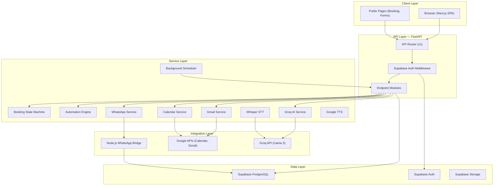
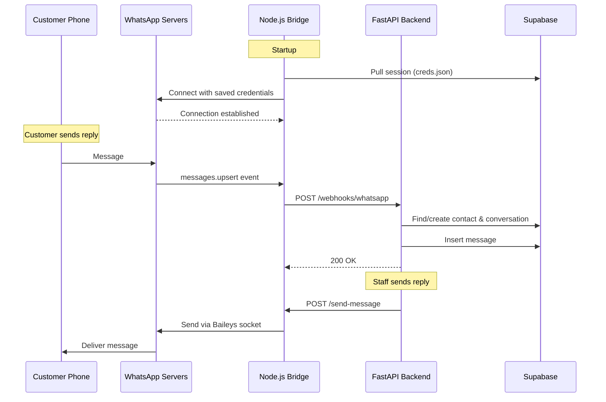
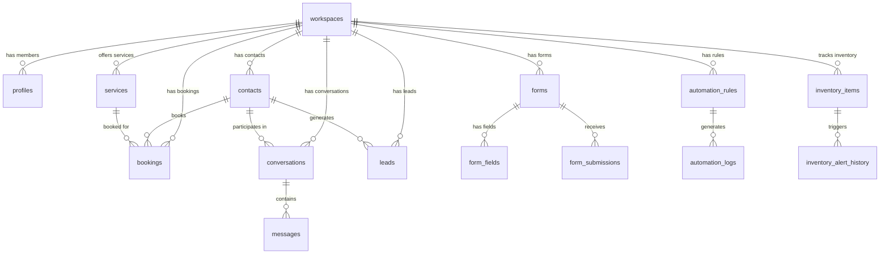
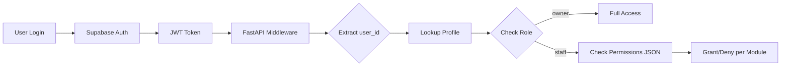
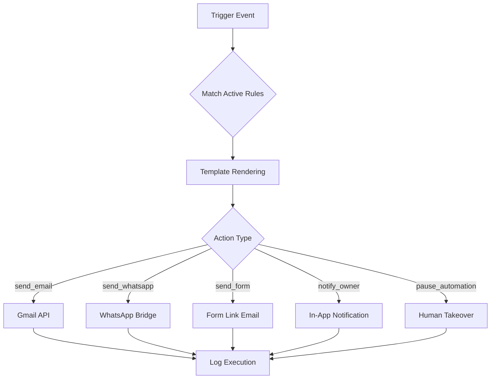
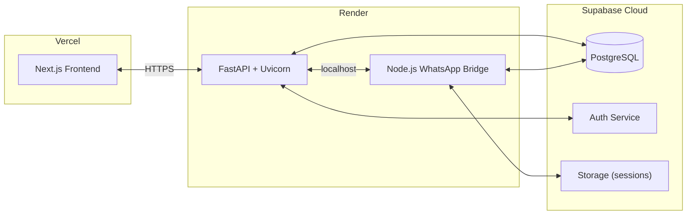

# CareOps — System Architecture

A deep-dive into the technical design, data flows, and infrastructure powering CareOps.

---

## System Overview

CareOps follows a **decoupled, multi-service architecture** with clear separation between the API layer, business logic, and external integrations. The system is designed for multi-tenancy from the ground up, with workspace-level isolation at every layer.

---

## Backend Architecture (Python / FastAPI)

### API Layer (`app/api/v1/endpoints/`)

RESTful endpoints organized by business domain. Each module handles its own CRUD, validation, and service orchestration.

| Module | Endpoints | Key Functionality |
|--------|-----------|-------------------|
| `bookings.py` | 15+ | Public booking page, slot availability, state transitions, Google Calendar sync, WhatsApp confirmation |
| `communications.py` | 12+ | Unified inbox, WhatsApp/Gmail/Telegram webhooks, AI reply suggestions, message threading |
| `forms.py` | 10+ | Form CRUD, field management, public submissions, submission analytics |
| `inventory.py` | 10+ | Item CRUD, supplier management, low-stock alerts, alert history |
| `automation.py` | 5+ | Rule CRUD, execution logs, trigger management |
| `dashboard.py` | 4+ | Real-time metrics, pending actions, AI-generated insights |
| `staff.py` | 6+ | Staff CRUD, permission management, role assignment |
| `google_auth.py` | 6+ | OAuth2 flow for Gmail/Calendar, token management, integration status |
| `onboarding.py` | 4+ | Conversational AI onboarding, workspace provisioning |
| `services.py` | 4+ | Service catalog management (what the business offers) |

### Service Layer (`app/services/`)

Encapsulated business logic, decoupled from HTTP concerns.

| Service | Purpose | Key Design |
|---------|---------|------------|
| `booking_state_machine.py` | Manages booking lifecycle transitions | Enum-based state machine: `pending → confirmed → completed/cancelled/no_show` |
| `automation_engine.py` | Executes rule-based automations | Trigger → match rules → execute actions (email, WhatsApp, forms) with template rendering |
| `groq_service.py` | AI-powered features via Groq API | Chat completion with retry logic, onboarding parsing, reply suggestions |
| `gmail_service.py` | Gmail integration via OAuth2 | Send/receive emails, sync inbox threads, manage OAuth tokens per workspace |
| `calendar_service.py` | Google Calendar sync | Create/update/delete calendar events tied to bookings |
| `whatsapp_service.py` | WhatsApp message API client | Sends messages via internal bridge, handles connection status |
| `scheduler.py` | Background task scheduler | Periodic execution of booking reminders, form follow-ups, automation triggers |
| `whisper_service.py` | Speech-to-text transcription | Whisper API integration for voice onboarding |
| `tts_service.py` | Text-to-speech generation | Google Cloud TTS for audio responses |
| `bridge_manager.py` | WhatsApp bridge process manager | Starts/monitors the Node.js bridge process in development |

### Dependency Injection

FastAPI's dependency injection system provides:
- **`CurrentUser`**: Extracts and validates the authenticated user from JWT
- **`SupabaseClient`**: Provides a service-role Supabase client
- **`AppSettings`**: Typed configuration from environment variables

---

## WhatsApp Bridge Architecture

A dedicated **Node.js + TypeScript** service using the **Baileys** library for WhatsApp Web integration.

**Key Design Decisions:**
- **Session persistence**: `creds.json` is synced to Supabase Storage, surviving container restarts on Render
- **Cross-workspace message routing**: The webhook handler finds existing conversations by `external_thread_id` across all workspaces, ensuring replies land in the correct thread regardless of bridge configuration
- **Connection resilience**: Automatic reconnection with exponential backoff (max 5 attempts), prekey management, and conflict resolution

---

## Database Schema

Multi-tenant PostgreSQL schema with 12+ tables, Row-Level Security, and workspace isolation.

### Core Tables

| Table | Purpose | Key Fields |
|-------|---------|------------|
| `workspaces` | Multi-tenancy root | `id`, `name`, `slug`, `settings` (JSONB) |
| `profiles` | User accounts linked to auth.users | `workspace_id`, `role`, `permissions` (JSONB) |
| `contacts` | CRM contact records | `phone`, `email`, `tags[]`, `lead_status`, `lead_source` |
| `conversations` | Communication threads | `channel`, `external_thread_id`, `last_message_at`, `is_read` |
| `messages` | Individual messages | `conversation_id`, `body`, `source`, `sender_type` |
| `bookings` | Appointment records | `contact_id`, `service_id`, `status`, `starts_at`, `gcal_event_id` |
| `services` | Business service catalog | `name`, `duration_min`, `price_cents`, `is_active` |
| `inventory_items` | Stock tracking | `quantity`, `unit`, `low_stock_threshold`, `supplier_*` |
| `forms` | Dynamic form definitions | `name`, `description`, `is_active` |
| `form_fields` | Form field definitions | `label`, `field_type`, `is_required`, `options` (JSONB) |
| `automation_rules` | Trigger-action rules | `trigger`, `action`, `config` (JSONB), `is_active` |
| `automation_logs` | Execution audit trail | `rule_id`, `trigger_payload`, `status`, `result` |

### Multi-Tenancy Strategy

Every table includes a `workspace_id` foreign key. Supabase Row-Level Security (RLS) policies ensure:
- Users can only access data within their workspace
- Service-role access bypasses RLS for webhooks and automation
- Public endpoints (booking page, forms) use workspace slug for routing

---

## Authentication & Authorization

- **Authentication**: Supabase Auth with JWT tokens
- **Authorization**: Role-based (owner/staff) + granular permissions stored as JSONB in `profiles.permissions`
- **Permission Keys**: `bookings`, `inbox`, `inventory`, `automation`, `forms`, `staff`, `leads`

---

## Automation Engine

The automation engine is a trigger-action system that responds to business events.

**Supported Triggers**: `new_lead`, `booking_confirmed`, `booking_completed`, `booking_cancelled`, `inventory_low`, `message_received`, `form_submitted`

**Supported Actions**: `send_email`, `send_whatsapp`, `send_form`, `notify_owner`, `pause_automation`

**Smart Features**:
- Mustache-style template rendering (`{{contact_name}}`, `{{booking_date}}`)
- Automation pause per conversation (human takeover detection)
- Background execution via FastAPI's `BackgroundTasks`

---

## Deployment Architecture

- **Frontend**: Deployed on Vercel with automatic builds from `main` branch
- **Backend**: Render web service running `start.sh` (starts both FastAPI and WhatsApp bridge)
- **Database**: Supabase managed PostgreSQL with automatic backups
- **Secrets**: Environment variables managed per-platform (Render, Vercel, Supabase)

---

## Key Technical Decisions

| Decision | Rationale |
|----------|-----------|
| FastAPI over Django/Flask | Async-first, automatic OpenAPI docs, Pydantic validation, dependency injection |
| Supabase over raw PostgreSQL | Built-in auth, RLS, real-time subscriptions, storage — reduces boilerplate |
| Baileys over official WhatsApp API | No business verification required, full message access, suitable for MVP |
| Groq over OpenAI | 10x faster inference (Llama 3 on Groq hardware), cost-effective for real-time chat |
| Next.js App Router | File-based routing, server components, built-in SEO, dynamic multi-tenant slugs |
| Zustand over Redux | Minimal boilerplate for workspace/auth state, React Query handles server state |
| Monorepo structure | Single deploy unit on Render, shared types, simplified CI/CD |
