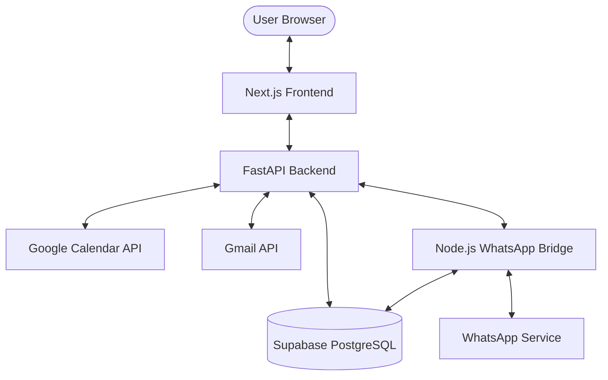

# CareOps Architecture

CareOps is a unified operations platform designed for service-based businesses, providing automated scheduling, multi-channel communications, and inventory management.

## System Overview

The system follows a modern decoupled architecture with a centralized backend service, an independent WhatsApp bridge, and a high-performance frontend dashboard.

## Backend Architecture (Python/FastAPI)

The backend is built with FastAPI, prioritizing high performance and modularity.

- **API Layer (`app/api/`)**: RESTful endpoints organized by domain (v1).
- **Service Layer (`app/services/`)**: Business logic encapsulation for:
    - `booking_state_machine.py`: Manages the lifecycle of service bookings.
    - `gmail_service.py`: Handles OAuth-authenticated email communications.
    - `calendar_service.py`: Synchronizes appointments with Google Calendar.
    - `whatsapp_service.py`: Interface for sending/receiving WhatsApp messages via the bridge.
    - `inventory_service.py`: Automated stock alerts and tracking.
- **Data Layer (`app/models/`)**: Pydantic models for request/response validation and database schemas.

## Frontend Architecture (Next.js/React)

A responsive, high-aesthetic dashboard built with the latest React patterns.

- **Framework**: Next.js (App Router) for SEO and performance.
- **UI System**: Tailwind CSS with custom premium design components.
- **State Management**:
    - **Zustand**: Lightweight stores for workspace and onboarding state.
    - **React Query**: Server state synchronization and caching.
- **Navigation**: Slug-based multi-workspace routing.

## WhatsApp Integration (`whatsapp-bridge/`)

A dedicated Node.js service using the Baileys library to interface with WhatsApp.

- **Bridge Service**: Handles terminal-based QR authentication and socket persistent connections.
- **Session Layer**: Syncs `creds.json` to Supabase to maintain sessions across server restarts.
- **Webhook System**: Forwards incoming messages to the FastAPI backend for AI-assisted processing.

## Infrastructure & Multi-Tenancy

- **Database**: Supabase (PostgreSQL) with Row-Level Security (RLS) and real-time triggers.
- **Storage**: Supabase Storage for invoice and media management.
- **Multi-Tenancy**: Workspace-level isolation using `workspace_id` throughout the schema.
- **Deployment**:
    - **Render**: Hosts the combined Python Backend and Node.js Bridge.
    - **Vercel**: Hosts the Next.js Frontend.

## Key Operational Flows

1. **Booking Flow**: User submits form -> State machine initializes -> Google Calendar reflects slot -> Reminder triggered via WhatsApp/Email.
2. **Onboarding Flow**: Multi-step configuration process with real-time validation and sync to Supabase.
3. **Inventory Alert Flow**: Stock falls below threshold -> Automation rule triggers -> Admin notified via dashboard and external channels.
