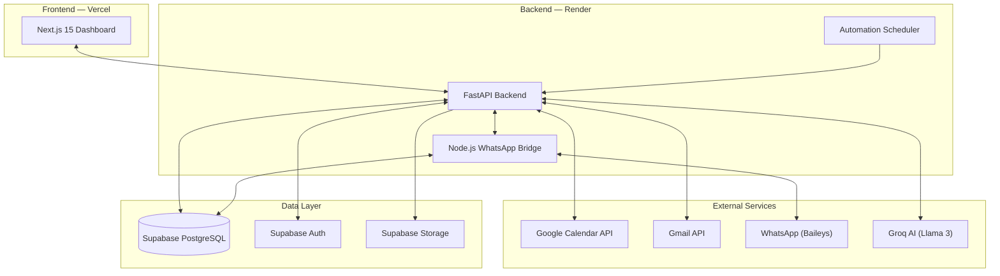

# CareOps

> **A full-stack, AI-powered operations platform for service-based businesses.**
> Automates scheduling, multi-channel communication, lead management, and inventory tracking — all from a single dashboard.

Built as a production-grade SaaS application with multi-tenant architecture, real-time integrations, and an AI automation engine.

---

## ✨ Key Features

| Module | Description |
|--------|-------------|
| **📅 Smart Booking Engine** | Public booking page → state-machine lifecycle → Google Calendar sync → automated WhatsApp/Email confirmations |
| **📬 Unified Inbox** | Threaded conversations across WhatsApp, Gmail, and Telegram in one view with AI-suggested replies |
| **🤖 Automation Engine** | Rule-based triggers (new lead, booking confirmed, inventory low) → automated actions (email, WhatsApp, form distribution) |
| **👥 Leads Management** | Capture from forms/bookings → status pipeline (new → contacted → qualified → converted) → convert to booking |
| **📋 Dynamic Forms** | Drag-and-drop form builder with public submission links and form-reminder automation |
| **📦 Inventory Tracking** | Stock monitoring with low-stock alerts, supplier management, and automated reorder notifications |
| **🗣️ AI Onboarding** | Conversational setup wizard powered by Groq (Llama 3) — configure your workspace by chatting |
| **👨‍💼 Staff & Permissions** | Role-based access (owner/staff) with granular permission controls per module |
| **📊 Analytics Dashboard** | Real-time metrics, action items, and AI-generated business insights |

---

## 🏗️ Architecture



See [ARCHITECTURE.md](./ARCHITECTURE.md) for a deep-dive into system design, and [FEATURES.md](./FEATURES.md) for detailed feature documentation.

---

## 🛠️ Tech Stack

### Backend
- **Framework**: Python 3.12, FastAPI, Pydantic v2, Uvicorn
- **AI/ML**: Groq API (Llama 3 / Mixtral), OpenAI Whisper (STT), Google Cloud TTS
- **Services**: Booking state machine, automation engine, Gmail OAuth2, Google Calendar sync
- **WhatsApp Bridge**: Node.js + TypeScript, Baileys (unofficial WA Web API), persistent sessions via Supabase

### Frontend
- **Framework**: Next.js 15 (App Router), React 19, TypeScript
- **Styling**: Tailwind CSS with custom design system
- **State**: Zustand (client state), React Query (server state)
- **Routing**: Dynamic workspace-slug-based multi-tenant routing

### Infrastructure
- **Database**: Supabase (PostgreSQL) with Row-Level Security, 12+ migrations
- **Auth**: Supabase Auth with JWT, role-based access
- **Hosting**: Render (backend + bridge), Vercel (frontend)
- **Multi-tenancy**: Full workspace isolation via `workspace_id` across all tables

---

## 📁 Project Structure

```
CareOps/
├── app/                          # Python backend
│   ├── api/v1/endpoints/         # REST API endpoints
│   │   ├── bookings.py           #   └─ Scheduling, calendar sync, public booking
│   │   ├── communications.py     #   └─ Unified inbox, WhatsApp/Gmail webhooks
│   │   ├── forms.py              #   └─ Form builder, public submissions
│   │   ├── inventory.py          #   └─ Stock tracking, alerts, suppliers
│   │   ├── automation.py         #   └─ Rule management, execution logs
│   │   ├── dashboard.py          #   └─ Metrics, actions, AI insights
│   │   ├── staff.py              #   └─ Staff management, permissions
│   │   ├── google_auth.py        #   └─ OAuth2 for Gmail & Calendar
│   │   └── onboarding.py         #   └─ AI-powered workspace setup
│   ├── services/                 # Business logic layer
│   │   ├── automation_engine.py  #   └─ Rule execution engine
│   │   ├── booking_state_machine.py  └─ Booking lifecycle management
│   │   ├── gmail_service.py      #   └─ OAuth2 email send/receive
│   │   ├── groq_service.py       #   └─ AI chat & parsing (Llama 3)
│   │   ├── scheduler.py          #   └─ Background job scheduler
│   │   ├── whatsapp_service.py   #   └─ Bridge API client
│   │   └── whisper_service.py    #   └─ Speech-to-text transcription
│   ├── models/                   # Pydantic schemas & DB models
│   ├── core/                     # Config, dependencies, auth
│   └── main.py                   # FastAPI app factory & lifespan
│
├── frontend/                     # Next.js frontend
│   ├── app/
│   │   ├── (auth)/               # Login/signup pages
│   │   ├── (dashboard)/          # Protected dashboard routes
│   │   │   └── [workspaceSlug]/  # Multi-tenant workspace pages
│   │   │       ├── page.tsx      #     └─ Dashboard home
│   │   │       ├── inbox/        #     └─ Unified inbox
│   │   │       ├── bookings/     #     └─ Booking management
│   │   │       ├── leads/        #     └─ Lead pipeline
│   │   │       ├── inventory/    #     └─ Stock management
│   │   │       ├── forms/        #     └─ Form builder
│   │   │       ├── automation/   #     └─ Automation rules
│   │   │       ├── staff/        #     └─ Team management
│   │   │       └── settings/     #     └─ Workspace settings
│   │   └── (public)/             # Public-facing pages
│   │       ├── b/                #     └─ Public booking page
│   │       ├── c/                #     └─ Public contact form
│   │       └── f/                #     └─ Public form submissions
│   ├── components/               # Reusable UI components
│   ├── stores/                   # Zustand state stores
│   └── lib/                      # API client, utilities
│
├── whatsapp-bridge/              # Node.js WhatsApp integration
│   └── src/index.ts              # Baileys socket, webhook relay
│
├── supabase/
│   ├── schema.sql                # Full database schema
│   └── migrations/               # 11 incremental migrations
│
├── start.sh                      # Production startup (Render)
└── build.sh                      # Production build script
```

---

## 🚀 Getting Started

### Prerequisites

- Python 3.12+
- Node.js 18+
- Supabase project (free tier works)

### 1. Backend Setup

```bash
# Clone the repo
git clone https://github.com/pruthvijain41/CareOps.git
cd CareOps

# Create virtual environment
python -m venv venv
source venv/bin/activate

# Install dependencies
pip install -r requirements.txt

# Configure environment
cp .env.example .env
# Edit .env with your Supabase, Groq, and Google Cloud credentials

# Start the backend
uvicorn app.main:app --reload --port 8000
```

### 2. Frontend Setup

```bash
cd frontend
npm install
npm run dev
# → http://localhost:3000
```

### 3. WhatsApp Bridge (optional)

```bash
cd whatsapp-bridge
npm install
npm run build
node dist/index.js
# → Scan QR code to authenticate
```

### Environment Variables

| Variable | Description |
|----------|-------------|
| `SUPABASE_URL` | Supabase project URL |
| `SUPABASE_SERVICE_ROLE_KEY` | Supabase service role key |
| `GROQ_API_KEY` | Groq API key for AI features |
| `GMAIL_CLIENT_ID` / `GMAIL_CLIENT_SECRET` | Google OAuth2 for Gmail |
| `GCAL_CLIENT_ID` / `GCAL_CLIENT_SECRET` | Google OAuth2 for Calendar |
| `GOOGLE_CLOUD_PROJECT_ID` | Google Cloud for TTS |
| `TELEGRAM_BOT_TOKEN` | Telegram bot integration |
| `WORKSPACE_ID` | Default workspace for WhatsApp bridge |

---

## 📖 Documentation

| Document | Description |
|----------|-------------|
| [ARCHITECTURE.md](./ARCHITECTURE.md) | System design, data flow, and infrastructure details |
| [FEATURES.md](./FEATURES.md) | Detailed feature documentation with technical implementation notes |

---

## 📄 License

Proprietary. All rights reserved.
